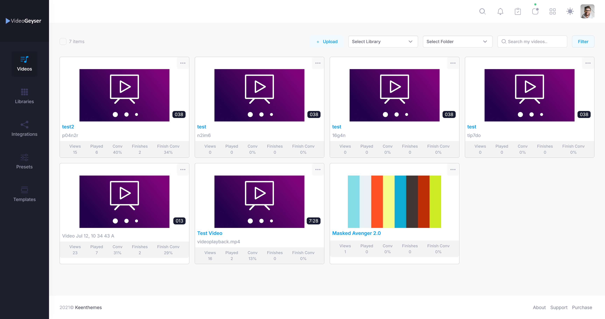
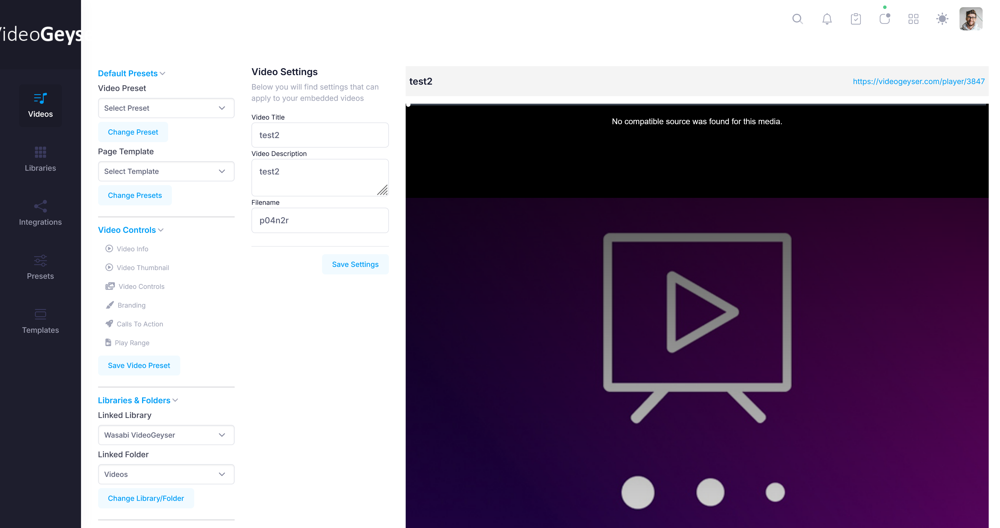
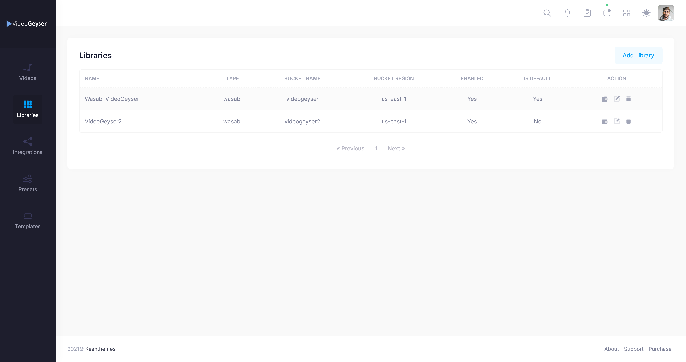
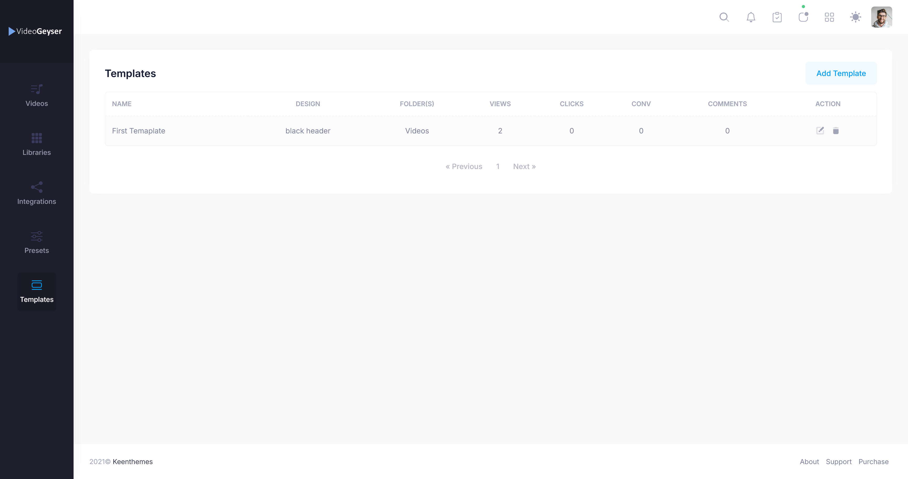
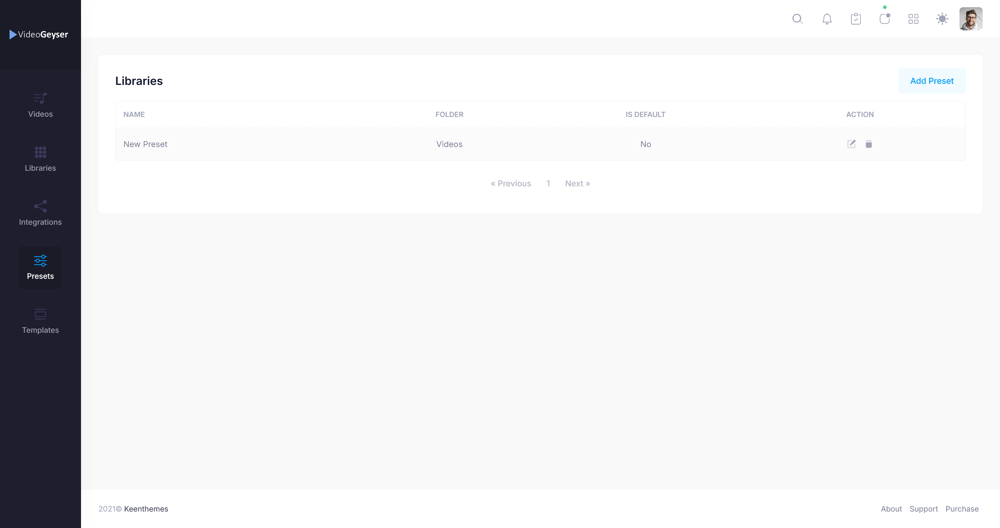
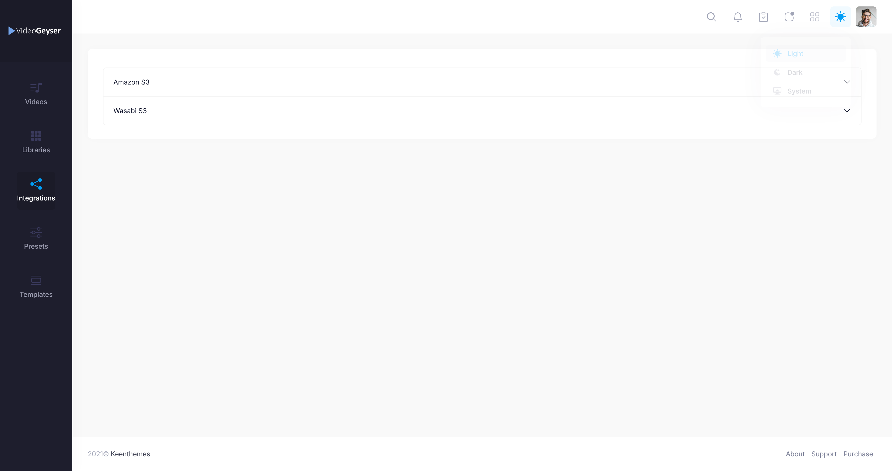

# Video Geyser

A white-label video hosting, delivery, and viewer-analytics platform built with Laravel and Vue. Unlike typical video hosts, Video Geyser doesn't store anyone's video: each account connects its own AWS S3 or Wasabi bucket during onboarding, and the app layers encoding, adaptive playback, branded lead-gen overlays, and per-view analytics on top of storage the user already owns.

It's the same category as Wistia or Vidyard, built from scratch: upload pipeline, HLS transcoding, a customizable video.js player, CTA-driven templates, and drop-off analytics, all running on infrastructure the customer controls.

> **Note:** this repository is a project showcase, not the source code. The codebase was built as client/proprietary work and isn't included here. This README and the screenshots below document the system and the engineering behind it. See [PRD.md](PRD.md) for the full requirements write-up.

**Role:** full-stack development, covering backend architecture (Laravel), the FFmpeg/HLS transcoding pipeline, the video.js player and its settings system, S3/Wasabi storage integration, and the YouTube/Vimeo/Facebook/Dropbox source adapters.

## Table of contents

- [Screenshots](#screenshots)
- [What it does](#what-it-does)
- [Architecture](#architecture)
- [Tech stack](#tech-stack)
- [Core features](#core-features)
- [Data model](#data-model)
- [Known limitations](#known-limitations)
- [Author](#author)

## Screenshots


*Video library: every upload with per-video views, plays, conversion rate, finishes, and finish-conversion, filterable by library/folder.*


*Per-video settings panel next to a live player preview: title/description, linked library/folder, preset, page template, and granular video controls (thumbnail, branding, calls to action, play range).*


*Connected storage libraries: each one maps to a customer-owned S3 or Wasabi bucket, with region and default-library status.*


*CTA templates with their own engagement stats: views, clicks, conversions, and comments, per template design.*


*Reusable presets that bundle player, branding, and CTA configuration to apply across multiple videos/folders at once.*


*Storage provider integrations: Amazon S3 and Wasabi S3, connected per account.*

## What it does

1. A new user runs through a 5-step onboarding wizard: pick a storage provider (Wasabi or AWS), enter their API keys, create a bucket through that provider's own API, and create a default folder, all without leaving the app.
2. They upload a video (resumable, chunked upload via FilePond, including direct multipart upload to S3 for large files).
3. The app transcodes it in the background into adaptive-bitrate HLS (up to 1080p) directly on the user's own bucket, grabs a thumbnail at a chosen timestamp, and reports live encode progress back to the UI.
4. The video plays back through a fully configurable video.js player (skin colors, autoplay, controls, aspect ratio, branding overlay, and more), and can be wrapped in a "Template": a CTA end-cap with a headline, description, and a clickable call-to-action button, for turning views into leads.
5. Every view is tracked: play starts, play position, pauses, completions, and exact drop-off point, so a user can see where viewers stop watching.
6. The same videos can also be pulled in from YouTube, Vimeo, Facebook, or Dropbox instead of self-hosted storage; the player resolves the right source and plays it the same way either way.

## Architecture

Monolithic Laravel + Inertia.js application: server-rendered routing, Vue 3 page components, no separate REST API layer for the app itself.

```
Browser (Vue 3 + Inertia + video.js)
        │
        ▼
Laravel 10 app (Inertia SPA, session auth)
        │
        ├── FilePond chunked upload ──► user's S3 / Wasabi bucket
        │
        ├── Queued jobs (Redis queue, Laravel Horizon)
        │     ConvertVideo (FFmpeg → HLS) ──► UpdateM3U8Files ──► UpdateVideo
        │     CreateThumbnail (separate "thumbnail" queue)
        │
        ├── Third-party source adapters: YouTube, Vimeo, Facebook, Dropbox
        │
        └── MySQL (videos, folders, libraries, templates, presets,
                    view/CTA analytics, per-user integrations)
```

Public, no-login routes serve the player itself (`/player/{video}`, `/embed/{video}`) so videos can be shared or embedded without viewers needing an account. Everything under `members/*` is authenticated and gated behind an `onboard` middleware that forces new users through the setup wizard before they can manage anything.

## Tech stack

| Layer | Technology |
|---|---|
| Backend | PHP 8.1, Laravel 10 |
| Frontend | Vue 3, TypeScript, Inertia.js, Pinia, Vite |
| Video playback | video.js 8 (HLS quality levels, quality selector, custom settings menu) |
| Transcoding | FFmpeg via `pbmedia/laravel-ffmpeg` (adaptive bitrate HLS) |
| Storage | AWS S3 and Wasabi, via `league/flysystem-aws-s3-v3` (per-user bucket) |
| Uploads | FilePond (chunked/resumable), direct S3 multipart upload |
| Queue | Redis, Laravel Horizon |
| Database | MySQL |
| Third-party integrations | YouTube Data API, Vimeo API, Facebook Graph API, Dropbox API |
| UI | Bootstrap 5, Element Plus, ApexCharts, TinyMCE/Quill |
| Local dev | Laravel Sail (Docker: PHP, MySQL, Redis) |

## Core features

**Multi-source video ingestion.** A video can originate from direct upload, YouTube, Vimeo, Facebook, Dropbox, or the user's own S3/Wasabi bucket. The player resolves whichever source type applies at render time, including refreshing signed/temporary links where a provider requires it.

**Self-hosted transcoding pipeline.** Uploaded video is transcoded into adaptive HLS with up to four renditions (360p–1080p) based on formats the user selects at upload time. A chained job pipeline (`ConvertVideo` → `UpdateM3U8Files` → `UpdateVideo`) handles encoding, playlist path rewriting, and status updates, with live progress polling in the UI.

**Configurable player.** Per-video or per-preset playback settings (autoplay, controls, muted, fullscreen, responsive sizing, skin color, aspect ratio, volume/seek UI) plus a branding overlay (logo, position, click-through URL) and trim offsets.

**Templates and presets.** Templates wrap a video in a lead-gen "end cap" (headline, resource copy, CTA button with its own text/URL/color). Presets bundle a reusable set of player, branding, and CTA settings to apply across many videos at once.

**Library → Folder → Video hierarchy.** A Library maps to a bucket/region; Folders live inside a Library and can set their own default preset, template, and thumbnail timestamp; Videos live inside Folders.

**Viewer analytics.** Per-session tracking of page views, play start, play position, pauses, completions, and drop-off point, surfaced as view/play/finish counts per video (the basis for a Wistia-style drop-off/engagement view).

**Template engagement tracking.** Separate view and click timestamps per template, for measuring CTA click-through.

**Third-party connections.** Per-user credentials for Wasabi, AWS S3, YouTube, Vimeo, Facebook, and Dropbox, managed through a dedicated integrations screen.

## Data model

Key tables (from `database/migrations`): `users`, `libraries`, `folders`, `videos`, `video_stats`, `video_exports`, `templates`, `template_stats`, `template_comments`, `presets`, `integrations`, `fileponds` (chunked/multipart upload state), `campaigns`, `categories`, `category_exports`, `category_auto_inputs`, `site_settings`, `transactions`, `error_logs`.

## Known limitations

This is an honest account of the current state, not a feature list dressed up:

- **No billing/subscription logic.** A `transactions` table exists but isn't wired to any payment provider in the code.
- **No teams or multi-user accounts.** Access control is a single `is_admin` flag per user, with no organizations or role-based permissions.
- **Campaign auto-publish is unfinished.** The `campaigns` and `category_auto_inputs` tables, plus commented-out methods in the YouTube/Vimeo/Dropbox integration classes, point to a planned "auto-pull and auto-publish videos from a channel" feature that was scaffolded but never finished or wired into an active controller.
- **No automated tests or CI pipeline** in the current codebase.

See [PRD.md](PRD.md) for the full requirements write-up, including what's implemented versus planned.

## Author

Built by **Ammad Sarfraz**.
